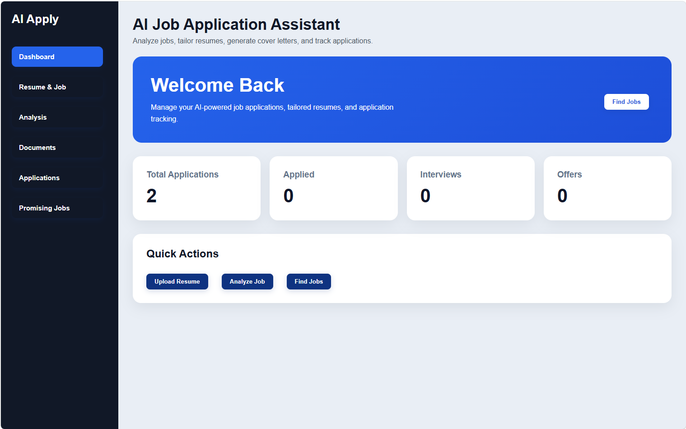
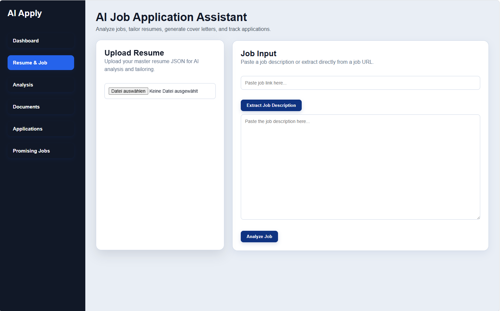
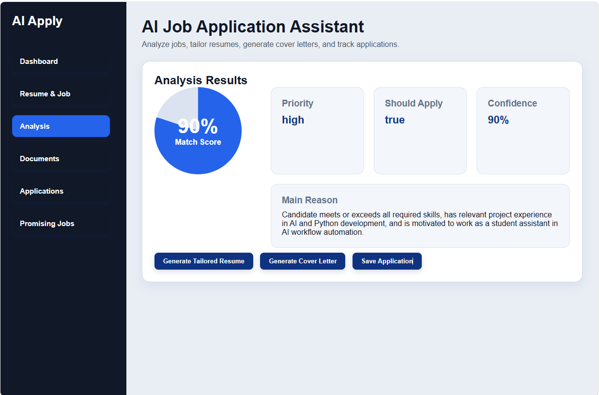
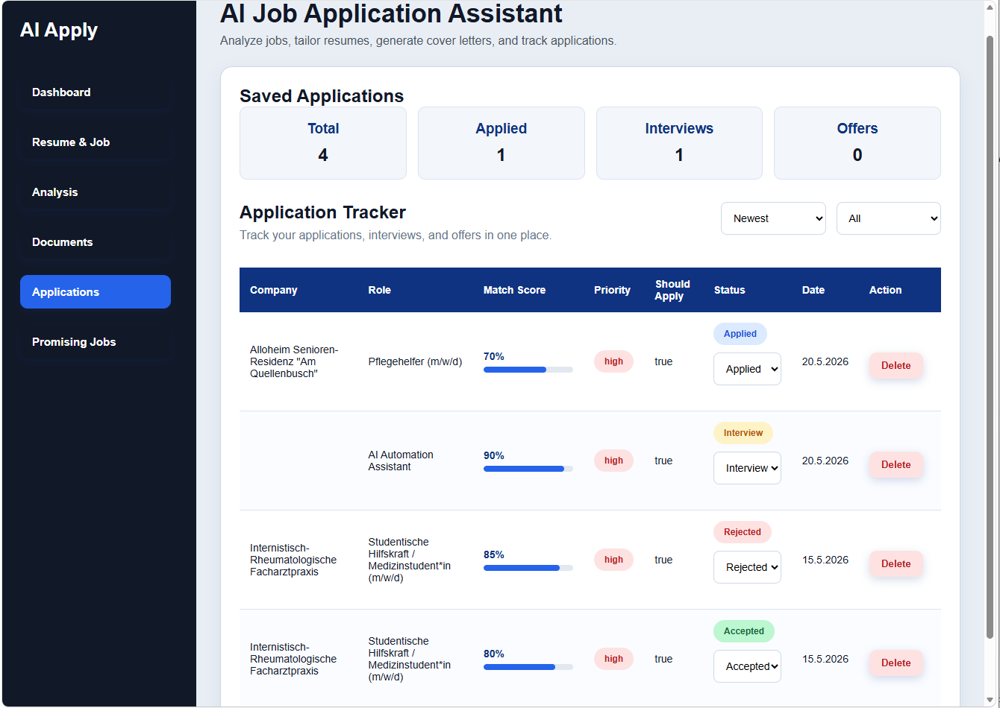
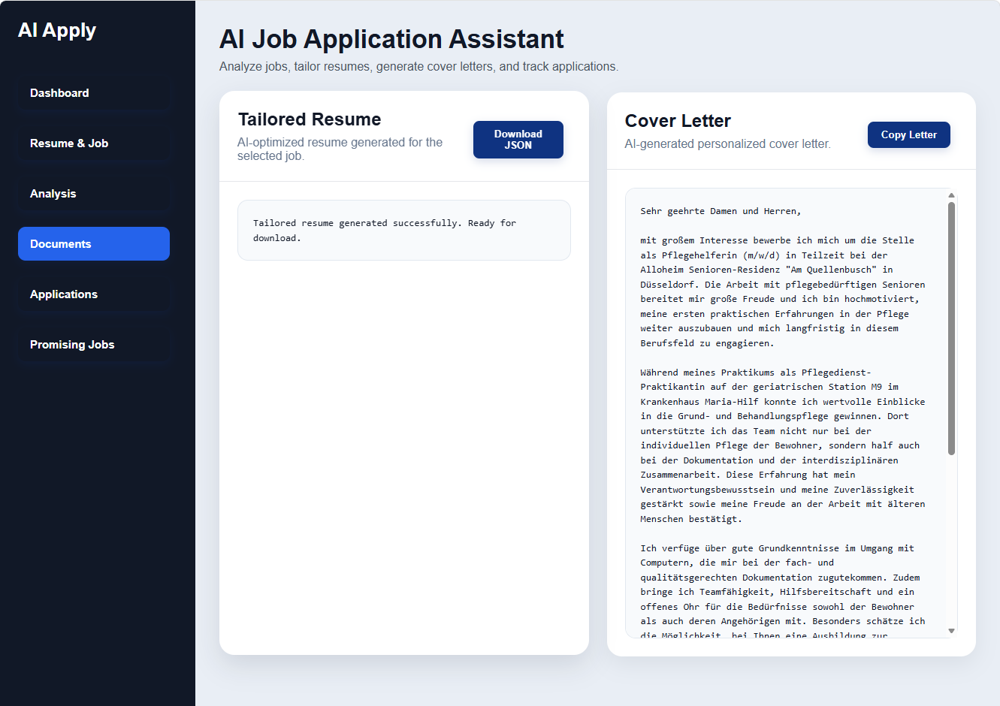
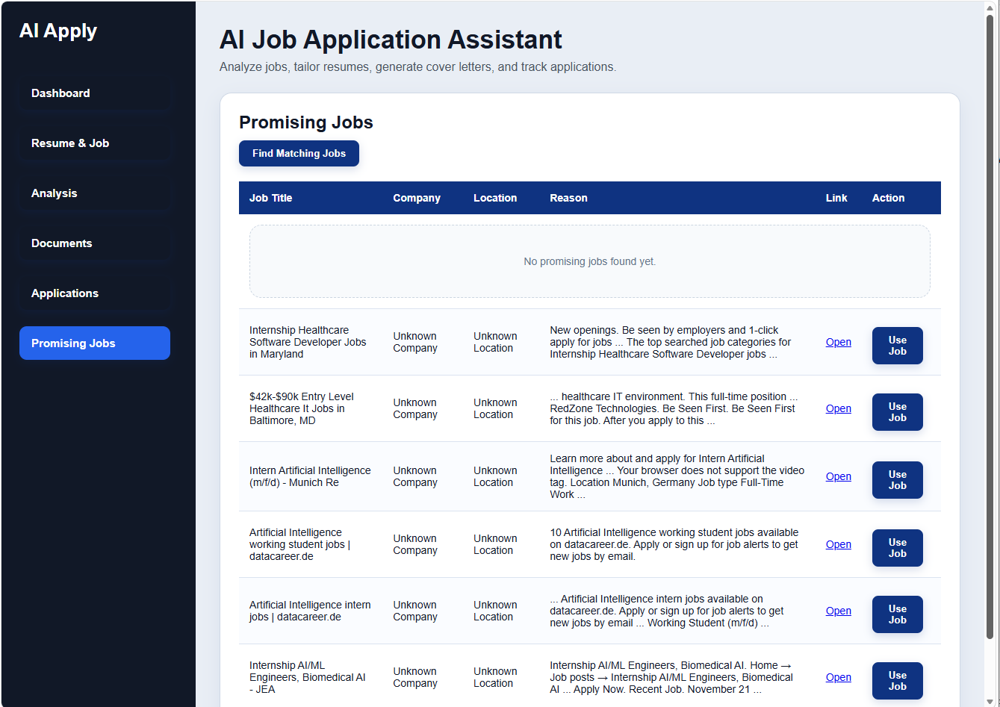

# AI Job Application Assistant

## 🚀 Overview

AI Job Application Assistant is a full-stack AI-powered SaaS platform designed to streamline and optimize the modern job application workflow.

The system analyzes job descriptions, evaluates candidate-job compatibility, generates ATS-optimized resumes, creates tailored cover letters, tracks applications, and helps users discover promising job opportunities through an intelligent workflow-driven interface.

Built with FastAPI, OpenAI APIs, JavaScript, HTML, CSS, and Reactive Resume JSON integration.

---

# ✨ Core Features

## 🔍 AI Job Analysis
- Deep AI-powered job description analysis
- Match score calculation
- Application recommendation engine
- Risk and gap analysis
- ATS keyword extraction
- Recruiter-oriented insights

---

## 📄 ATS Resume Tailoring
- AI-powered Reactive Resume JSON optimization
- Intelligent relevance filtering
- ATS keyword alignment
- Recruiter-focused resume enhancement
- Language localization support
- Dynamic section visibility control
- XYZ bullet-point optimization formula

---

## ✉️ AI Cover Letter Generation
- Personalized cover letters
- Job-specific tone adaptation
- Recruiter-focused language
- Dynamic candidate-job alignment

---

## 📊 Application Tracker Dashboard
- Application management system
- Match score visualization
- Status tracking
- Priority indicators
- Dashboard analytics
- Workflow-based navigation

---

## 💼 Job Discovery System
- AI-assisted job search
- Promising job recommendations
- Job workflow integration
- Quick-apply preparation flow

---

## 🎨 Modern SaaS UI
- Responsive dashboard layout
- Sidebar navigation system
- Loading states and animations
- Status badges and progress bars
- Workflow-driven UX
- Multi-view application structure

---

# 🧠 System Workflow

```text
Job Description
        ↓
AI Job Analysis
        ↓
ATS Resume Tailoring
        ↓
AI Cover Letter Generation
        ↓
Application Tracking
        ↓
Job Workflow Management
```

---

# 🏗️ Tech Stack

## Backend
- Python
- FastAPI
- OpenAI API
- Pydantic
- Uvicorn

## Frontend
- HTML5
- CSS3
- JavaScript

## AI & Resume Systems
- OpenAI GPT-4.1-mini
- Reactive Resume JSON
- ATS Optimization Logic

## Deployment
- Render (Backend)
- Netlify (Frontend)

---

# 🧩 Architecture

## Backend Responsibilities
- AI orchestration
- Prompt engineering
- JSON validation
- Resume optimization
- Job analysis workflows
- Cover letter generation
- API handling

## Frontend Responsibilities
- Dashboard rendering
- Workflow navigation
- State management
- Application tracking
- User interaction
- Data visualization

---

# 📈 AI Features

## Prompt Engineering
Custom prompt-engineering architecture for:
- ATS optimization
- Resume localization
- Recruiter-focused tailoring
- Identity preservation
- Structured JSON generation

---

## Resume Intelligence
The system:
- prioritizes relevant experience
- hides irrelevant sections
- improves recruiter readability
- preserves authenticity
- localizes resume content dynamically

---

# 📱 UI Highlights

- Responsive SaaS dashboard
- Status badges
- Match score progress bars
- Animated transitions
- Loading spinners
- Dashboard statistics
- Multi-step workflow navigation

---

# 🔒 Validation & Reliability

- Pydantic schema validation
- JSON structure enforcement
- AI response cleaning
- Language consistency enforcement
- Structured error handling

---

# 🌍 Deployment

## Frontend
Netlify Deployment:

https://ai-job-application-assist.netlify.app

## Backend
Render Deployment:

https://ai-job-application-assistant-dy68.onrender.com

---

# 🛠️ Local Setup

## Clone Repository

```bash
git clone <https://github.com/davinamuyinza-ops/ai_job_application_assistant>
```

---

## Backend Setup

```bash
cd backend

python -m venv .venv

.venv\Scripts\activate

pip install -r requirements.txt

uvicorn app:app --reload
```

---

## Frontend Setup

Open:

```text
index.html
```

or use:

```bash
python -m http.server
```

---

# 🔑 Environment Variables

Create a `.env` file:

```env
OPENAI_API_KEY=your_api_key
```

---

# 📌 Future Improvements

- Multi-provider job APIs
- Resume PDF export
- Authentication system
- User accounts
- Database integration
- Resume version history
- AI interview preparation
- Analytics dashboard expansion
- AI workflow automation integrations

---

# 📷 Screenshots

## Dashboard



---

## Uploads



---

## Job Analysis



---

## Application Tracker



---

## Documents View



---

## Job Search



---

# 🎯 Portfolio Value

This project demonstrates:
- AI system design
- Prompt engineering
- Full-stack development
- SaaS architecture
- FastAPI backend engineering
- Frontend dashboard design
- Workflow automation
- JSON-based AI orchestration
- ATS optimization systems
- Production deployment workflows

---

# 👩‍💻 Author

Davina Muyinza

Medical Informatics Student  
AI Systems & Workflow Automation Builder  
Frontend + AI Workflow Development  
Quality Assurance & ATS Optimization Focus